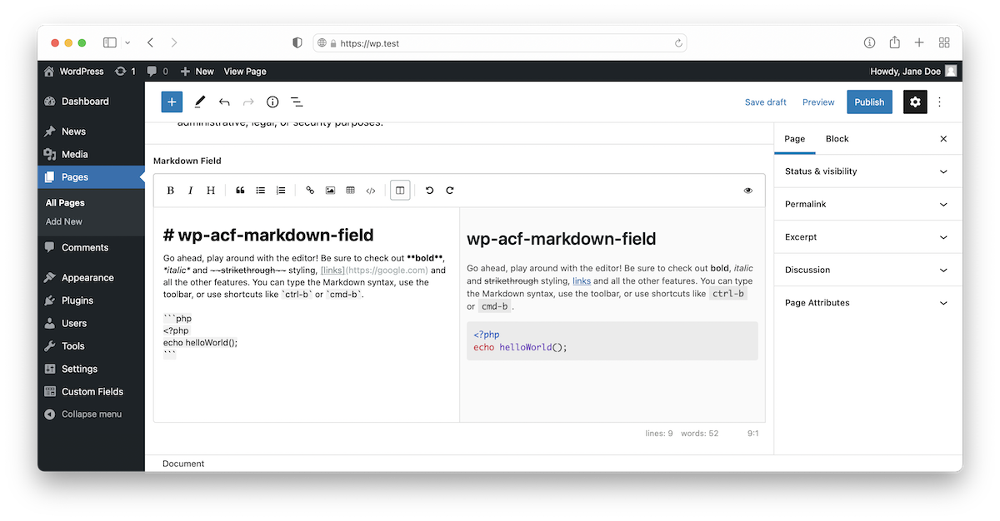

# 📝 ACF Markdown Field

**A WordPress plugin that includes a markdown field type for use with the ACF plugin.**

---



## Features

- Adds a `markdown` field type for use with the [Advanced Custom Fields](https://www.advancedcustomfields.com) plugin. 
- Supports the WP media picker for embedding images into markdown content.

## Requirements

- Advanced Custom Fields `>= 5`
- PHP `>= 5.4`

## Installation

Use Composer to install the `mu-plugin`.

```
composer require freshsystems/wp-acf-markdown-field
```

 If your WordPress project doesn't support [directory-based mu-plugins](https://github.com/roots/bedrock-autoloader), or you'd prefer to install the plugin as a regular `plugin`, you can override the default install path in your project's composer file (ensuring that you use the correct path to your project's plugin directory).

```
...

"extra": {
    "installer-paths": {
        "web/app/plugins/{$name}/": ["freshsystems/wp-acf-markdown-field"]
    }
}

...
```

If you're not using [Composer with WordPress](https://roots.io/bedrock-vs-regular-wordpress-install/), you can alternatively download the ZIP archive from the releases page and upload/install the plugin manually.
